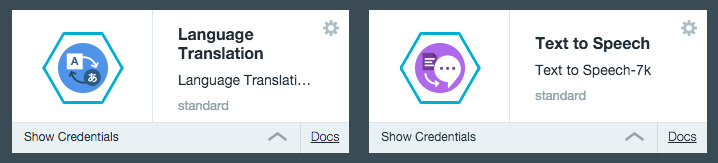
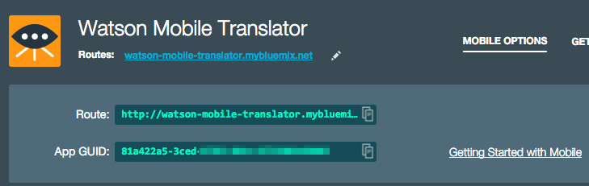

#Watson Translator
The **Watson Translator** app leverages IBM Watson [language translation][translation] and [text to speech services][tts] with the open source [Tesseract OCR engine][tesseract] to create a sample interface that allows you to extract text from an image, and then translate that text to another language, and even generate spoken audio in another language from that translation. The app has also been configured to use [Bluemix Mobile Client Access][ama_url] for operational analyticsat runtime.


*Note: This should not be confused with any of IBM Research's OCR (Optical Character Recognition) or Natural-Scene OCR work.  The OCR in this example is based on the open source Tesseract project, which works best with dark text on a light background.* 
 
--- 

### Bluemix Services Used

1. [Mobile Client Access][ama_url] - Capture analytics and logs from mobile apps running on devices
2. [Watson Language Translation][translation] - Language translation service
3. [Watson Text To Speech][tts] - Audible language synthesis from text

---

### Setting Up The Bluemix Backend


1. Create a Bluemix Account

    [Sign up][bluemix_signup_url] for Bluemix, or sign in using an existing account.
	
2. From the Bluemix Dashboard, click on the "Create App" link, then select the "Mobile" template and walk through the process of creating your app infrastructure.  *Remember the app namel you are going to need it later.*

3. From the app dashboard, add the [Watson Language Translation][translation] and [Watson Speech To Text][stt] services.

   

4. Download and install the [Cloud-foundry CLI][cloud_foundry_url] tool.  This will be used to deploy your Node.js back end.

5. Clone the app to your local environment from your terminal using the following command

  ```
  git clone https://github.com/triceam/Watson-Translator.git
  ```

6. Back in the command line termianl, cd into this newly created directory, then go into the /server directory.

7. Connect to Bluemix in the command line tool and follow the prompts to log in.

  ```
  $ cf api https://api.ng.bluemix.net
  $ cf login
  ```

8. Push it to Bluemix. This will automatically deploy the back end app and start the Node.js instance.  Replace "AppName" with the name of your app on Bluemix.

  ```
  $ cf push AppName
  ```
  
9. Voila! You now have your very own API instance up and running on Bluemix.  Next we need to configure the Mobile Client application.  You can test your Node.js app deployment at https://yourapp.mybluemix.net *(use your actual app route)*.  

---

### Setting Up The Mobile App

The native iOS application requires **Xcode 6.4** running on a Mac to compile and deploy on either the iOS Simulator or on a development device.  Xcode 6.4 is required to target Apple WatchOS 1.0.

1. If you do not already have it, download and install [CocoaPods][cocoapods_url].

2. In a terminal window, cd into the /client directory (from your local project directory).

3. Run the *pod install* command to setup the Xcode project and download all dependencies.

  ```
  $ pod install
  ```

4. This will create an Xcode Workspace file.  Open the **Bluemix-MicrosoftBand.xcworkspace** file in Xcode.
 
5. Configure Facebook as the identity provider.  This configuration requires settings both on the Mobile Client Access service and in the native code project (inside the "client" directory for this project).   In the local project, be sure to follow the instructions for both sections: [configuring the Facebook SDK][facebook_sdk_config] and [Configuring Faebook Authentication][facebook_auth]. Be sure to make the appropriate changes inside of Info.plist.

6. Open the "**AppDelegate.m**" file.  Update the connection to Bluemix on line 24 to include your app's route and GUID.   

  ```
  [imfClient initializeWithBackendRoute:@"bluemix app route"
                             backendGUID:@"bluemix app guid"];
  ```
 
  You can access the route and app GUID under "Mobile Options" on the app dashboard.
  
  

7. Open the file "**AudioManager.m**" and update the urlString instance to use your application route on Bluemix.

  ```
  NSString *urlString = [NSString stringWithFormat:@"https://appname.mybluemix.net/synthesize?text=%@&download=1&voice=%@&accept=audio/flac", phrase, voice ];
  ```

8. Open the file "**TranslationManager.m**" and update the request url on line 24 to use your application route on Bluemix.

  ```
  IMFResourceRequest * imfRequest = [IMFResourceRequest requestWithPath:@"https://appname.mybluemix.net/translate" method:@"GET" parameters:params];
  ```

9. Now you are all set!  Launch the app on a device that has been paired with a Microsoft Band.  Tap on the "Start Heart Rate Sensor" button to start capturing data.  After the heartate capture is complete, data will be saved locally and replicated up to Cloudant.  You will be able to see your data in the web interface once that data has been replicated successfully to Cloudant.   
 
 
---

### Dependencies & 3rd Party Libraries

The following 3rd party libraries were used in the creation of this demo:

1. [GPUImage][gpuimage] - GPU accelerated image processing
2. [OrigamiEngine][origamiengine] - Audio playback for the FLAC file format
3. [Tesseract OCR][tesseract] - Optical Character Recognition

---

### Troubleshooting

To troubleshoot your the server side of your Bluemix app the main useful source of information is the logs. To see them, run:

  ```
  $ cf logs <application-name> --recent
  ```
  
  
[bluemix_signup_url]: https://ibm.biz/IBM-Bluemix
[bluemix_dashboard_url]: https://ibm.biz/Bluemix-Dashboard
[cloud_foundry_url]: https://github.com/cloudfoundry/cli
[download_node_url]: https://nodejs.org/download/
[cocoapods_url]: https://cocoapods.org/
[ama_url]: https://ibm.biz/Bluemix-AdvancedMobileAccess
[tesseract]: https://github.com/gali8/Tesseract-OCR-iOS
[tts]: https://ibm.biz/Watson-TTS
[translation]: http://ibm.biz/WatsonTranslation
[gpuimage]: https://github.com/BradLarson/GPUImage
[origamiengine]: https://github.com/ap4y/OrigamiEngine